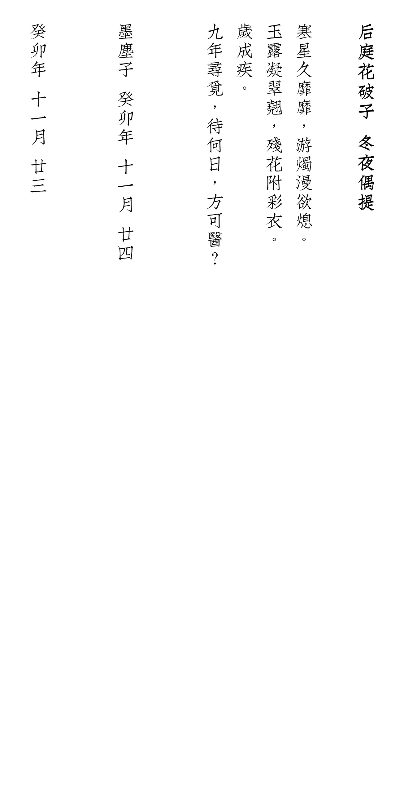

<style type="text/css">

body > * {
    margin-left: 3rem;
}

#content {
    width: 38rem;
    padding-bottom: 4rem;
}

iframe {
    margin-left: -1rem;
}

</style>

In my free time I write poetry in ancient chinese style.

准确来说是填词，对我的词风影响最大的是花间词派。

Here is one example:

<div class="img-container">
后庭花破子 冬夜偶提 <br/> <br/>
  
</div>


To be updated soon.

<!-- See the website for my photography here: <a href="https://photography.danielroelfs.com" target="_blank">photography.danielroelfs.com</a> -->
<!-- ```{r}
#| label: iframe
#| echo: FALSE

htmltools::tags$iframe(
  src = "https://photography.danielroelfs.com/",
  onload = "this.width='100%';this.height=screen.height*0.5;",
  frameBorder = "0"
)
``` -->
